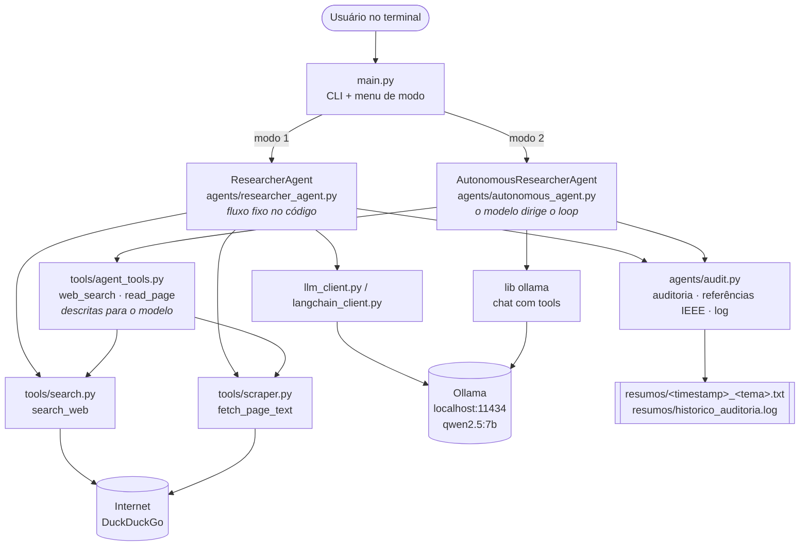
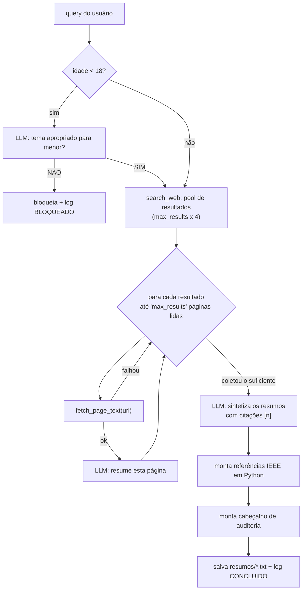
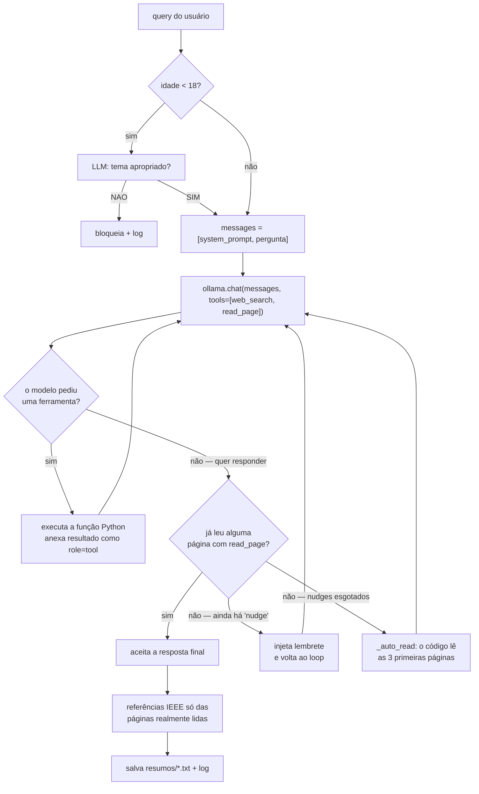
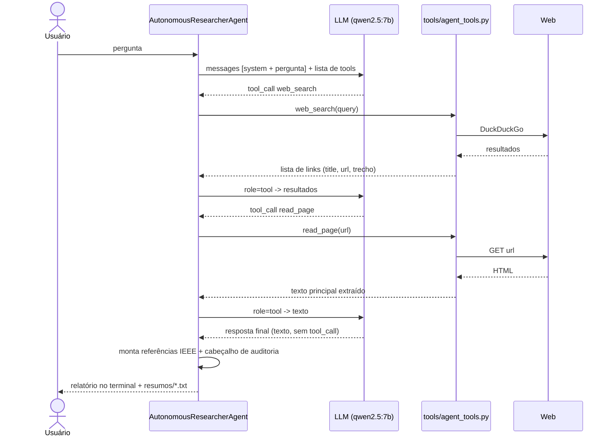
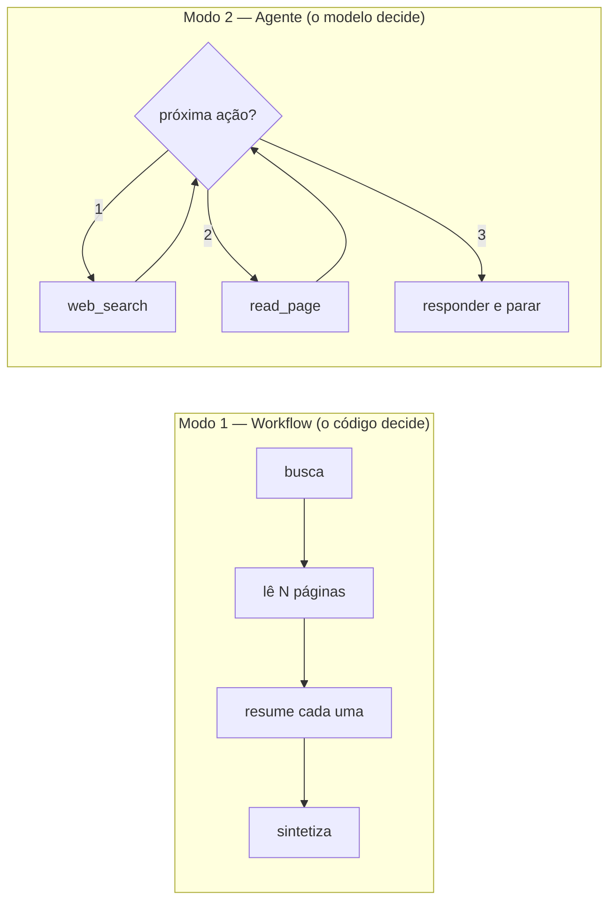

# mult-agent

CLI de pesquisa que **busca na web, lê as páginas e resume com um LLM local**
(Ollama / `qwen2.5:7b`), salvando um relatório com cabeçalho de auditoria e
referências no padrão IEEE.

O projeto existe para estudar, na prática, a fronteira entre um **workflow**
(o código decide os passos) e um **agente autônomo** (o modelo decide os passos).
Por isso ele tem **dois modos**, escolhidos no menu inicial.

> Documentos irmãos:
> - [`ARQUITETURA.md`](ARQUITETURA.md) — Python para quem vem de Java, o que é um
>   agente, o que o Ollama faz na sua máquina.
> - [`AGENTE_AUTONOMO.md`](AGENTE_AUTONOMO.md) — detalhes do modo 2 e das
>   limitações do ambiente.

---

## 1. Visão geral



Regra de dependência (como "camadas" numa arquitetura Java):
**`tools/` não conhece `agents/`; `agents/` conhece `tools/` e os clients;
`main.py` só conhece `agents/`.**

---

## 2. Estrutura de arquivos

| Arquivo | Papel | Camada (analogia Java) |
|---|---|---|
| `main.py` | CLI: pergunta modo → nome/idade → loop de perguntas | Controller |
| `agents/researcher_agent.py` | **Modo 1**: pipeline determinístico | Service |
| `agents/autonomous_agent.py` | **Modo 2**: loop de tool-calling | Service |
| `agents/audit.py` | Auditoria, referências IEEE, log — compartilhado | Service util |
| `llm_client.py` | Fala com o LLM via lib `ollama` (chamada direta) | Client |
| `langchain_client.py` | Idem, via LangChain (pode não carregar — ver §6) | Client |
| `tools/search.py` | `search_web()` — DuckDuckGo via `ddgs` | Infra / DAO |
| `tools/scraper.py` | `fetch_page_text()` — download + extração de texto | Infra / DAO |
| `tools/agent_tools.py` | `web_search` / `read_page` **expostas ao modelo** + `SourceTracker` | Infra |
| `resumos/` | Saída (criada em runtime): 1 `.txt` por pesquisa + log de auditoria | — |

---

## 3. Modo 1 — Pipeline determinístico

O fluxo é fixo, escrito em `for`/`if`. O modelo é chamado só para tarefas
pontuais (moderar, resumir, sintetizar) e **nunca decide o próximo passo**.



---

## 4. Modo 2 — Agente autônomo

Existe um **loop**: a cada rodada o modelo recebe as ferramentas e responde
*"chame a ferramenta X"* ou *"aqui está a resposta final"*. Quem decide **se**
busca, **o que** busca, **quantas vezes** e **quando parar** é o modelo.



### O loop, como troca de mensagens



### Workflow x Agente, lado a lado



---

## 5. Ferramentas, segurança e saída

- **Ferramentas** (`tools/agent_tools.py`): o *docstring* de cada função vira a
  descrição que o modelo lê, e a assinatura tipada vira o schema dos argumentos.
  A lib `ollama` faz essa conversão sozinha.
- **Filtro de menor de idade**: checagem determinística **antes** do loop, nos
  dois modos. Segurança não é delegada ao modelo.
- **Referências IEEE**: montadas em Python (`agents/audit.py`) a partir das
  páginas que passaram de fato por `read_page`/`fetch_page_text` — o modelo
  costuma "citar" URLs que inventou; essas são ignoradas.
- **Saída**: `resumos/<timestamp>_<tema>.txt` (cabeçalho de auditoria + síntese +
  referências) e uma linha em `resumos/historico_auditoria.log` para **toda**
  tentativa, inclusive as bloqueadas.

---

## 6. Ambiente e limitações conhecidas

- **Smart App Control (Windows)** ativo neste PC bloqueia DLLs nativas não
  assinadas instaladas via pip:
  - `uuid_utils` (dep de `langchain-core`) → o modo 1 com **LangChain** quebra no
    import; `main.py` detecta e volta pro Ollama direto sozinho.
  - `lxml` (dep de `trafilatura`) → por isso `tools/scraper.py` tem um **fallback
    puro-Python** (`html.parser` + `httpx`), com qualidade um pouco menor.
- **Modelo pequeno**: o `qwen2.5:7b` às vezes se recusa a usar as ferramentas e
  tenta responder "de cabeça". O modo 2 tem dois freios determinísticos
  (`GROUNDING_NUDGE` e `_auto_read`) para garantir que a resposta seja
  fundamentada. Com um modelo maior ou via API, esses freios quase não disparam.

---

## 7. Como rodar

Pré-requisito: **app do Ollama aberto** (servidor em `localhost:11434`) com o
modelo baixado — `ollama pull qwen2.5:7b`.

```bat
:: sempre pelo Python do venv (NÃO use "py" ou "python" direto)
.venv\Scripts\python.exe main.py
```

Ou ativando o ambiente primeiro:

```bat
.venv\Scripts\activate
python main.py
```

Instalação das dependências (uma vez):

```bat
.venv\Scripts\python.exe -m pip install -r requirements.txt
```

No menu, escolha **1** (pipeline determinístico) ou **2** (agente autônomo).
No modo 2, cada ferramenta que o modelo decide chamar aparece em *magenta* no
terminal, em tempo real.

---

## 8. Como visualizar os diagramas

Os blocos ` ```mermaid ` acima renderizam direto no GitHub/GitLab e no preview de
Markdown do VS Code (extensão *Markdown Preview Mermaid Support*). Para exportar
imagem: cole o código em <https://mermaid.live> e baixe PNG/SVG.
